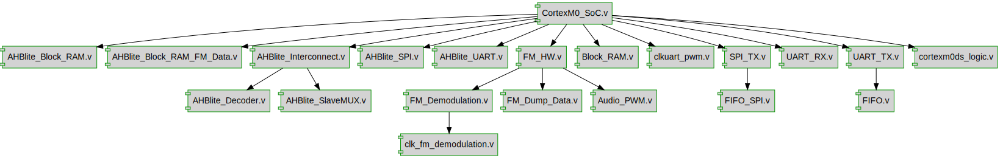

# Documentation for: MMC

Generated by **TerosHDL** © 2020-2021 License GPLv3 Carlos Alberto Ruiz Naranjo (carlosruiznaranjo@gmail.com) Ismael Perez Rojo (ismaelprojo@gmail.com)  Project revision 2022-05-28 15:09:30  

## Designs

- Module: [AHBlite_Block_RAM ](./doc_internal/AHBlite_Block_RAM.md)
- Module: [AHBlite_Block_RAM_FM_Data ](./doc_internal/AHBlite_Block_RAM_FM_Data.md)
- Module: [AHBlite_Decoder ](./doc_internal/AHBlite_Decoder.md)
- Module: [AHBlite_Interconnect ](./doc_internal/AHBlite_Interconnect.md)
- Module: [AHBlite_SlaveMUX ](./doc_internal/AHBlite_SlaveMUX.md)
- Module: [AHBlite_SPI ](./doc_internal/AHBlite_SPI.md)
- Module: [AHBlite_UART ](./doc_internal/AHBlite_UART.md)
- Module: [clk_fm_demo_sample_pwm ](./doc_internal/clk_fm_demodulation.md)
- Module: [FM_Demodulation ](./doc_internal/FM_Demodulation.md)
- Module: [FM_Dump_Data ](./doc_internal/FM_Dump_Data.md)
- Module: [FM_HW ](./doc_internal/FM_HW.md)
- Module: [Audio_PWM ](./doc_internal/Audio_PWM.md)
- Module: [Block_RAM ](./doc_internal/Block_RAM.md)
- Module: [clkuart_pwm ](./doc_internal/clkuart_pwm.md)
- Module: [FIFO ](./doc_internal/FIFO.md)
- Module: [FIFO_SPI ](./doc_internal/FIFO_SPI.md)
- Module: [SPI_TX ](./doc_internal/SPI_TX.md)
- Module: [UART_RX ](./doc_internal/UART_RX.md)
- Module: [UART_TX ](./doc_internal/UART_TX.md)
- Module: [CortexM0_SoC ](./doc_internal/CortexM0_SoC.md)

