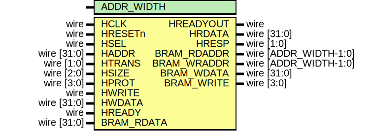
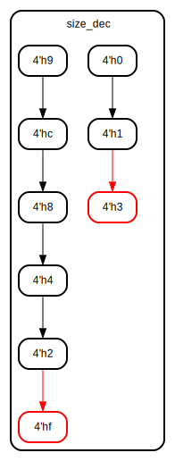

# Entity: AHBlite_Block_RAM 

- **File**: AHBlite_Block_RAM.v
## Diagram

## Generics

| Generic name | Type | Value | Description |
| ------------ | ---- | ----- | ----------- |
| ADDR_WIDTH   |      | 12    |             |
## Ports

| Port name   | Direction | Type                    | Description |
| ----------- | --------- | ----------------------- | ----------- |
| HCLK        | input     | wire                    |             |
| HRESETn     | input     | wire                    |             |
| HSEL        | input     | wire                    |             |
| HADDR       | input     | wire   [31:0]           |             |
| HTRANS      | input     | wire   [1:0]            |             |
| HSIZE       | input     | wire   [2:0]            |             |
| HPROT       | input     | wire   [3:0]            |             |
| HWRITE      | input     | wire                    |             |
| HWDATA      | input     | wire   [31:0]           |             |
| HREADY      | input     | wire                    |             |
| HREADYOUT   | output    | wire                    |             |
| HRDATA      | output    | wire   [31:0]           |             |
| HRESP       | output    | wire   [1:0]            |             |
| BRAM_RDADDR | output    | wire   [ADDR_WIDTH-1:0] |             |
| BRAM_WRADDR | output    | wire   [ADDR_WIDTH-1:0] |             |
| BRAM_RDATA  | input     | wire   [31:0]           |             |
| BRAM_WDATA  | output    | wire   [31:0]           |             |
| BRAM_WRITE  | output    | wire   [3:0]            |             |
## Signals

| Name      | Type                 | Description |
| --------- | -------------------- | ----------- |
| trans_en  | wire                 |             |
| write_en  | wire                 |             |
| read_en   | wire                 |             |
| size_dec  | reg [3:0]            |             |
| size_reg  | reg [3:0]            |             |
| addr_reg  | reg [ADDR_WIDTH-1:0] |             |
| wr_en_reg | reg                  |             |
## State machines

