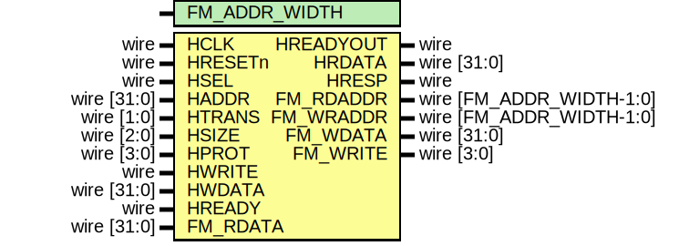
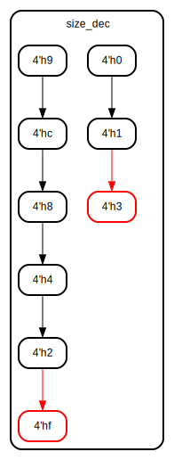

# Entity: AHBlite_Block_RAM_FM_Data 

- **File**: AHBlite_Block_RAM_FM_Data.v
## Diagram

## Generics

| Generic name  | Type | Value | Description |
| ------------- | ---- | ----- | ----------- |
| FM_ADDR_WIDTH |      | 13    |             |
## Ports

| Port name | Direction | Type                       | Description |
| --------- | --------- | -------------------------- | ----------- |
| HCLK      | input     | wire                       |             |
| HRESETn   | input     | wire                       |             |
| HSEL      | input     | wire                       |             |
| HADDR     | input     | wire   [31:0]              |             |
| HTRANS    | input     | wire   [1:0]               |             |
| HSIZE     | input     | wire   [2:0]               |             |
| HPROT     | input     | wire   [3:0]               |             |
| HWRITE    | input     | wire                       |             |
| HWDATA    | input     | wire   [31:0]              |             |
| HREADY    | input     | wire                       |             |
| HREADYOUT | output    | wire                       |             |
| HRDATA    | output    | wire   [31:0]              |             |
| HRESP     | output    | wire                       |             |
| FM_RDADDR | output    | wire   [FM_ADDR_WIDTH-1:0] |             |
| FM_WRADDR | output    | wire   [FM_ADDR_WIDTH-1:0] |             |
| FM_RDATA  | input     | wire   [31:0]              |             |
| FM_WDATA  | output    | wire   [31:0]              |             |
| FM_WRITE  | output    | wire   [3:0]               |             |
## Signals

| Name      | Type                    | Description |
| --------- | ----------------------- | ----------- |
| trans_en  | wire                    |             |
| write_en  | wire                    |             |
| read_en   | wire                    |             |
| size_dec  | reg [3:0]               |             |
| size_reg  | reg [3:0]               |             |
| addr_reg  | reg [FM_ADDR_WIDTH-1:0] |             |
| wr_en_reg | reg                     |             |
## State machines

