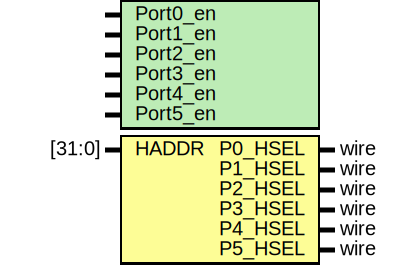

# Entity: AHBlite_Decoder 

- **File**: AHBlite_Decoder.v
## Diagram

## Generics

| Generic name | Type | Value | Description |
| ------------ | ---- | ----- | ----------- |
| Port0_en     |      | 1     |             |
| Port1_en     |      | 1     |             |
| Port2_en     |      | 1     |             |
| Port3_en     |      | 1     |             |
| Port4_en     |      | 1     |             |
| Port5_en     |      | 1     |             |
## Ports

| Port name | Direction | Type   | Description |
| --------- | --------- | ------ | ----------- |
| HADDR     | input     | [31:0] |             |
| P0_HSEL   | output    | wire   |             |
| P1_HSEL   | output    | wire   |             |
| P2_HSEL   | output    | wire   |             |
| P3_HSEL   | output    | wire   |             |
| P4_HSEL   | output    | wire   |             |
| P5_HSEL   | output    | wire   |             |
