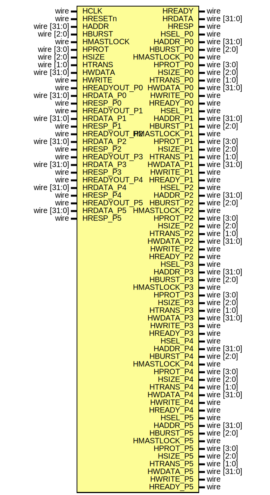

# Entity: AHBlite_Interconnect 

- **File**: AHBlite_Interconnect.v
## Diagram

## Ports

| Port name    | Direction | Type           | Description |
| ------------ | --------- | -------------- | ----------- |
| HCLK         | input     | wire           |             |
| HRESETn      | input     | wire           |             |
| HADDR        | input     | wire    [31:0] |             |
| HBURST       | input     | wire    [2:0]  |             |
| HMASTLOCK    | input     | wire           |             |
| HPROT        | input     | wire    [3:0]  |             |
| HSIZE        | input     | wire    [2:0]  |             |
| HTRANS       | input     | wire    [1:0]  |             |
| HWDATA       | input     | wire    [31:0] |             |
| HWRITE       | input     | wire           |             |
| HREADY       | output    | wire           |             |
| HRDATA       | output    | wire    [31:0] |             |
| HRESP        | output    | wire           |             |
| HSEL_P0      | output    | wire           |             |
| HADDR_P0     | output    | wire    [31:0] |             |
| HBURST_P0    | output    | wire    [2:0]  |             |
| HMASTLOCK_P0 | output    | wire           |             |
| HPROT_P0     | output    | wire    [3:0]  |             |
| HSIZE_P0     | output    | wire    [2:0]  |             |
| HTRANS_P0    | output    | wire    [1:0]  |             |
| HWDATA_P0    | output    | wire    [31:0] |             |
| HWRITE_P0    | output    | wire           |             |
| HREADY_P0    | output    | wire           |             |
| HREADYOUT_P0 | input     | wire           |             |
| HRDATA_P0    | input     | wire    [31:0] |             |
| HRESP_P0     | input     | wire           |             |
| HSEL_P1      | output    | wire           |             |
| HADDR_P1     | output    | wire    [31:0] |             |
| HBURST_P1    | output    | wire    [2:0]  |             |
| HMASTLOCK_P1 | output    | wire           |             |
| HPROT_P1     | output    | wire    [3:0]  |             |
| HSIZE_P1     | output    | wire    [2:0]  |             |
| HTRANS_P1    | output    | wire    [1:0]  |             |
| HWDATA_P1    | output    | wire    [31:0] |             |
| HWRITE_P1    | output    | wire           |             |
| HREADY_P1    | output    | wire           |             |
| HREADYOUT_P1 | input     | wire           |             |
| HRDATA_P1    | input     | wire    [31:0] |             |
| HRESP_P1     | input     | wire           |             |
| HSEL_P2      | output    | wire           |             |
| HADDR_P2     | output    | wire    [31:0] |             |
| HBURST_P2    | output    | wire    [2:0]  |             |
| HMASTLOCK_P2 | output    | wire           |             |
| HPROT_P2     | output    | wire    [3:0]  |             |
| HSIZE_P2     | output    | wire    [2:0]  |             |
| HTRANS_P2    | output    | wire    [1:0]  |             |
| HWDATA_P2    | output    | wire    [31:0] |             |
| HWRITE_P2    | output    | wire           |             |
| HREADY_P2    | output    | wire           |             |
| HREADYOUT_P2 | input     | wire           |             |
| HRDATA_P2    | input     | wire    [31:0] |             |
| HRESP_P2     | input     | wire           |             |
| HSEL_P3      | output    | wire           |             |
| HADDR_P3     | output    | wire    [31:0] |             |
| HBURST_P3    | output    | wire    [2:0]  |             |
| HMASTLOCK_P3 | output    | wire           |             |
| HPROT_P3     | output    | wire    [3:0]  |             |
| HSIZE_P3     | output    | wire    [2:0]  |             |
| HTRANS_P3    | output    | wire    [1:0]  |             |
| HWDATA_P3    | output    | wire    [31:0] |             |
| HWRITE_P3    | output    | wire           |             |
| HREADY_P3    | output    | wire           |             |
| HREADYOUT_P3 | input     | wire           |             |
| HRDATA_P3    | input     | wire    [31:0] |             |
| HRESP_P3     | input     | wire           |             |
| HSEL_P4      | output    | wire           |             |
| HADDR_P4     | output    | wire    [31:0] |             |
| HBURST_P4    | output    | wire    [2:0]  |             |
| HMASTLOCK_P4 | output    | wire           |             |
| HPROT_P4     | output    | wire    [3:0]  |             |
| HSIZE_P4     | output    | wire    [2:0]  |             |
| HTRANS_P4    | output    | wire    [1:0]  |             |
| HWDATA_P4    | output    | wire    [31:0] |             |
| HWRITE_P4    | output    | wire           |             |
| HREADY_P4    | output    | wire           |             |
| HREADYOUT_P4 | input     | wire           |             |
| HRDATA_P4    | input     | wire    [31:0] |             |
| HRESP_P4     | input     | wire           |             |
| HSEL_P5      | output    | wire           |             |
| HADDR_P5     | output    | wire    [31:0] |             |
| HBURST_P5    | output    | wire    [2:0]  |             |
| HMASTLOCK_P5 | output    | wire           |             |
| HPROT_P5     | output    | wire    [3:0]  |             |
| HSIZE_P5     | output    | wire    [2:0]  |             |
| HTRANS_P5    | output    | wire    [1:0]  |             |
| HWDATA_P5    | output    | wire    [31:0] |             |
| HWRITE_P5    | output    | wire           |             |
| HREADY_P5    | output    | wire           |             |
| HREADYOUT_P5 | input     | wire           |             |
| HRDATA_P5    | input     | wire    [31:0] |             |
| HRESP_P5     | input     | wire           |             |
## Instantiations

- Decoder: AHBlite_Decoder
- SlaveMUX: AHBlite_SlaveMUX
