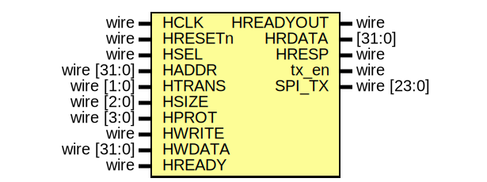

# Entity: AHBlite_SPI 

- **File**: AHBlite_SPI.v
## Diagram

## Ports

| Port name | Direction | Type           | Description |
| --------- | --------- | -------------- | ----------- |
| HCLK      | input     | wire           |             |
| HRESETn   | input     | wire           |             |
| HSEL      | input     | wire           |             |
| HADDR     | input     | wire   [31:0]  |             |
| HTRANS    | input     | wire    [1:0]  |             |
| HSIZE     | input     | wire    [2:0]  |             |
| HPROT     | input     | wire    [3:0]  |             |
| HWRITE    | input     | wire           |             |
| HWDATA    | input     | wire   [31:0]  |             |
| HREADY    | input     | wire           |             |
| HREADYOUT | output    | wire           |             |
| HRDATA    | output    | [31:0]         |             |
| HRESP     | output    | wire           |             |
| tx_en     | output    | wire           |             |
| SPI_TX    | output    | wire    [23:0] |             |
## Signals

| Name      | Type      | Description |
| --------- | --------- | ----------- |
| read_en   | wire      |             |
| write_en  | wire      |             |
| addr_reg  | reg [3:0] |             |
| rd_en_reg | reg       |             |
| wr_en_reg | reg       |             |
