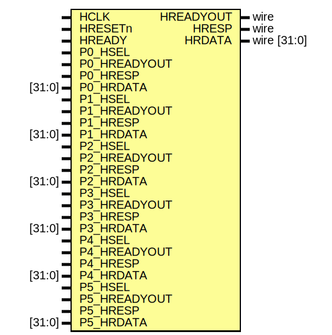

# Entity: AHBlite_SlaveMUX 

- **File**: AHBlite_SlaveMUX.v
## Diagram

## Ports

| Port name    | Direction | Type        | Description |
| ------------ | --------- | ----------- | ----------- |
| HCLK         | input     |             |             |
| HRESETn      | input     |             |             |
| HREADY       | input     |             |             |
| P0_HSEL      | input     |             |             |
| P0_HREADYOUT | input     |             |             |
| P0_HRESP     | input     |             |             |
| P0_HRDATA    | input     | [31:0]      |             |
| P1_HSEL      | input     |             |             |
| P1_HREADYOUT | input     |             |             |
| P1_HRESP     | input     |             |             |
| P1_HRDATA    | input     | [31:0]      |             |
| P2_HSEL      | input     |             |             |
| P2_HREADYOUT | input     |             |             |
| P2_HRESP     | input     |             |             |
| P2_HRDATA    | input     | [31:0]      |             |
| P3_HSEL      | input     |             |             |
| P3_HREADYOUT | input     |             |             |
| P3_HRESP     | input     |             |             |
| P3_HRDATA    | input     | [31:0]      |             |
| P4_HSEL      | input     |             |             |
| P4_HREADYOUT | input     |             |             |
| P4_HRESP     | input     |             |             |
| P4_HRDATA    | input     | [31:0]      |             |
| P5_HSEL      | input     |             |             |
| P5_HREADYOUT | input     |             |             |
| P5_HRESP     | input     |             |             |
| P5_HRDATA    | input     | [31:0]      |             |
| HREADYOUT    | output    | wire        |             |
| HRESP        | output    | wire        |             |
| HRDATA       | output    | wire [31:0] |             |
## Signals

| Name       | Type       | Description |
| ---------- | ---------- | ----------- |
| hsel_reg   | reg [5:0]  |             |
| hready_mux | reg        |             |
| hresp_mux  | reg        |             |
| hrdata_mux | reg [31:0] |             |
