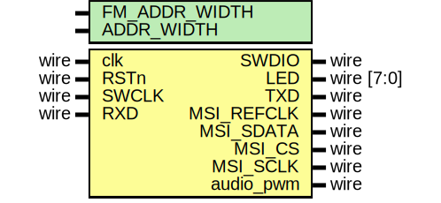

# Entity: CortexM0_SoC 

- **File**: CortexM0_SoC.v
## Diagram

## Generics

| Generic name  | Type | Value | Description |
| ------------- | ---- | ----- | ----------- |
| FM_ADDR_WIDTH |      | 13    |             |
| ADDR_WIDTH    |      | 12    |             |
## Ports

| Port name  | Direction | Type       | Description |
| ---------- | --------- | ---------- | ----------- |
| clk        | input     | wire       |             |
| RSTn       | input     | wire       |             |
| SWDIO      | inout     | wire       |             |
| SWCLK      | input     | wire       |             |
| LED        | output    | wire [7:0] |             |
| TXD        | output    | wire       |             |
| RXD        | input     | wire       |             |
| MSI_REFCLK | output    | wire       |             |
| MSI_SDATA  | output    | wire       |             |
| MSI_CS     | output    | wire       |             |
| MSI_SCLK   | output    | wire       |             |
| audio_pwm  | output    | wire       |             |
## Signals

| Name                     | Type                     | Description |
| ------------------------ | ------------------------ | ----------- |
| SWDO                     | wire                     |             |
| SWDOEN                   | wire                     |             |
| SWDI                     | wire                     |             |
| IRQ                      | wire [31:0]              |             |
| interrupt_UART           | wire                     |             |
| interrupt_IQ_done        | wire                     |             |
| Demo_Dump_Done_Interrupt | wire                     |             |
| RXEV                     | wire                     |             |
| HADDR                    | wire [31:0]              |             |
| HBURST                   | wire [ 2:0]              |             |
| HMASTLOCK                | wire                     |             |
| HPROT                    | wire [ 3:0]              |             |
| HSIZE                    | wire [ 2:0]              |             |
| HTRANS                   | wire [ 1:0]              |             |
| HWDATA                   | wire [31:0]              |             |
| HWRITE                   | wire                     |             |
| HRDATA                   | wire [31:0]              |             |
| HRESP                    | wire                     |             |
| HMASTER                  | wire                     |             |
| HREADY                   | wire                     |             |
| SYSRESETREQ              | wire                     |             |
| cpuresetn                | reg                      |             |
| CDBGPWRUPREQ             | wire                     |             |
| CDBGPWRUPACK             | reg                      |             |
| HSEL_P0                  | wire                     |             |
| HADDR_P0                 | wire [31:0]              |             |
| HBURST_P0                | wire [2:0]               |             |
| HMASTLOCK_P0             | wire                     |             |
| HPROT_P0                 | wire [3:0]               |             |
| HSIZE_P0                 | wire [2:0]               |             |
| HTRANS_P0                | wire [1:0]               |             |
| HWDATA_P0                | wire [31:0]              |             |
| HWRITE_P0                | wire                     |             |
| HREADY_P0                | wire                     |             |
| HREADYOUT_P0             | wire                     |             |
| HRDATA_P0                | wire [31:0]              |             |
| HRESP_P0                 | wire                     |             |
| HSEL_P1                  | wire                     |             |
| HADDR_P1                 | wire [31:0]              |             |
| HBURST_P1                | wire [2:0]               |             |
| HMASTLOCK_P1             | wire                     |             |
| HPROT_P1                 | wire [3:0]               |             |
| HSIZE_P1                 | wire [2:0]               |             |
| HTRANS_P1                | wire [1:0]               |             |
| HWDATA_P1                | wire [31:0]              |             |
| HWRITE_P1                | wire                     |             |
| HREADY_P1                | wire                     |             |
| HREADYOUT_P1             | wire                     |             |
| HRDATA_P1                | wire [31:0]              |             |
| HRESP_P1                 | wire                     |             |
| HSEL_P2                  | wire                     |             |
| HADDR_P2                 | wire [31:0]              |             |
| HBURST_P2                | wire [2:0]               |             |
| HMASTLOCK_P2             | wire                     |             |
| HPROT_P2                 | wire [3:0]               |             |
| HSIZE_P2                 | wire [2:0]               |             |
| HTRANS_P2                | wire [1:0]               |             |
| HWDATA_P2                | wire [31:0]              |             |
| HWRITE_P2                | wire                     |             |
| HREADY_P2                | wire                     |             |
| HREADYOUT_P2             | wire                     |             |
| HRDATA_P2                | wire [31:0]              |             |
| HRESP_P2                 | wire                     |             |
| HSEL_P3                  | wire                     |             |
| HADDR_P3                 | wire [31:0]              |             |
| HBURST_P3                | wire [2:0]               |             |
| HMASTLOCK_P3             | wire                     |             |
| HPROT_P3                 | wire [3:0]               |             |
| HSIZE_P3                 | wire [2:0]               |             |
| HTRANS_P3                | wire [1:0]               |             |
| HWDATA_P3                | wire [31:0]              |             |
| HWRITE_P3                | wire                     |             |
| HREADY_P3                | wire                     |             |
| HREADYOUT_P3             | wire                     |             |
| HRDATA_P3                | wire [31:0]              |             |
| HRESP_P3                 | wire                     |             |
| HSEL_P4                  | wire                     |             |
| HADDR_P4                 | wire [31:0]              |             |
| HBURST_P4                | wire [2:0]               |             |
| HMASTLOCK_P4             | wire                     |             |
| HPROT_P4                 | wire [3:0]               |             |
| HSIZE_P4                 | wire [2:0]               |             |
| HTRANS_P4                | wire [1:0]               |             |
| HWDATA_P4                | wire [31:0]              |             |
| HWRITE_P4                | wire                     |             |
| HREADY_P4                | wire                     |             |
| HREADYOUT_P4             | wire                     |             |
| HRDATA_P4                | wire [31:0]              |             |
| HRESP_P4                 | wire                     |             |
| HSEL_P5                  | wire                     |             |
| HADDR_P5                 | wire [31:0]              |             |
| HBURST_P5                | wire [2:0]               |             |
| HMASTLOCK_P5             | wire                     |             |
| HPROT_P5                 | wire [3:0]               |             |
| HSIZE_P5                 | wire [2:0]               |             |
| HTRANS_P5                | wire [1:0]               |             |
| HWDATA_P5                | wire [31:0]              |             |
| HWRITE_P5                | wire                     |             |
| HREADY_P5                | wire                     |             |
| HREADYOUT_P5             | wire                     |             |
| HRDATA_P5                | wire [31:0]              |             |
| HRESP_P5                 | wire                     |             |
| RAMCODE_RDATA            | wire [31:0]              |             |
| RAMCODE_WDATA            | wire [31:0]              |             |
| RAMCODE_WADDR            | wire [ADDR_WIDTH-1:0]    |             |
| RAMCODE_RADDR            | wire [ADDR_WIDTH-1:0]    |             |
| RAMCODE_WRITE            | wire [3:0]               |             |
| RAMDATA_RDATA            | wire [31:0]              |             |
| RAMDATA_WDATA            | wire [31:0]              |             |
| RAMDATA_WADDR            | wire [ADDR_WIDTH-1:0]    |             |
| RAMDATA_RADDR            | wire [ADDR_WIDTH-1:0]    |             |
| RAMDATA_WRITE            | wire [3:0]               |             |
| FMDATA_RDATA             | wire [31:0]              |             |
| FMDATA_WDATA             | wire [31:0]              |             |
| FMDATA_WADDR             | wire [FM_ADDR_WIDTH-1:0] |             |
| FMDATA_RADDR             | wire [FM_ADDR_WIDTH-1:0] |             |
| FMDATA_WRITE             | wire [3:0]               |             |
| state                    | wire                     |             |
| UART_RX_data             | wire [7:0]               |             |
| UART_TX_data             | wire [7:0]               |             |
| tx_en                    | wire                     |             |
| SPI_TX_Data              | wire [23:0]              |             |
| SPI_tx_en                | wire                     |             |
| clk_uart                 | wire                     |             |
| bps_en                   | wire                     |             |
| bps_en_rx                | wire                     |             |
| bps_en_tx                | wire                     |             |
| CW_CLK_MSI               | wire                     |             |
| CLK_Lock_MSI             | wire                     |             |
## Instantiations

- u_logic: cortexm0ds_logic
- Interconncet: AHBlite_Interconnect
- RAMCODE_Interface: AHBlite_Block_RAM
- RAMDATA_Interface: AHBlite_Block_RAM
- FMDATA_Interface: AHBlite_Block_RAM_FM_Data
- UART_Interface: AHBlite_UART
- SPI_Interface: AHBlite_SPI
- RAM_CODE: Block_RAM
- RAM_DATA: Block_RAM
- FM_HW: FM_HW
- SPI_TX: SPI_TX
- clkuart_pwm: clkuart_pwm
- UART_RX: UART_RX
- UART_TX: UART_TX
- MSI_REF_CLK: RF_REF_24M
