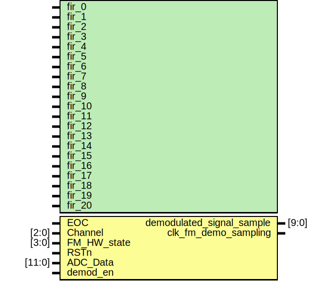

# Entity: FM_Demodulation 

- **File**: FM_Demodulation.v
## Diagram

## Generics

| Generic name | Type | Value  | Description |
| ------------ | ---- | ------ | ----------- |
| fir_0        |      | 8'h11  |             |
| fir_1        |      | 8'h22  |             |
| fir_2        |      | 8'h39  |             |
| fir_3        |      | 8'h55  |             |
| fir_4        |      | 8'h76  |             |
| fir_5        |      | 8'h98  |             |
| fir_6        |      | 8'hb9  |             |
| fir_7        |      | 8'hd7  |             |
| fir_8        |      | 8'hef  |             |
| fir_9        |      | 9'hfe  |             |
| fir_10       |      | 9'h103 |             |
| fir_11       |      | 8'hfe  |             |
| fir_12       |      | 8'hef  |             |
| fir_13       |      | 8'hd7  |             |
| fir_14       |      | 8'hb9  |             |
| fir_15       |      | 8'h98  |             |
| fir_16       |      | 8'h76  |             |
| fir_17       |      | 8'h55  |             |
| fir_18       |      | 8'h39  |             |
| fir_19       |      | 8'h22  |             |
| fir_20       |      | 8'h11  |             |
## Ports

| Port name                 | Direction | Type   | Description |
| ------------------------- | --------- | ------ | ----------- |
| EOC                       | input     |        |             |
| Channel                   | input     | [2:0]  |             |
| FM_HW_state               | input     | [3:0]  |             |
| RSTn                      | input     |        |             |
| ADC_Data                  | input     | [11:0] |             |
| demod_en                  | input     |        |             |
| demodulated_signal_sample | output    | [9:0]  |             |
| clk_fm_demo_sampling      | output    |        |             |
## Signals

| Name                    | Type       | Description |
| ----------------------- | ---------- | ----------- |
| IdataN_1                | reg [7:0]  |             |
| IdataN                  | reg [7:0]  |             |
| QdataN_1                | reg [7:0]  |             |
| QdataN                  | reg [7:0]  |             |
| EOC_Count_Demodulate    | reg        |             |
| demodulated_signal_temp | reg [16:0] |             |
| dmd_data_filter         | reg [9:0]  |             |
| dmd_data_filtered       | reg [23:0] |             |
| ii                      | integer    |             |
## Instantiations

- fm_sample: clk_fm_demo_sample_pwm
