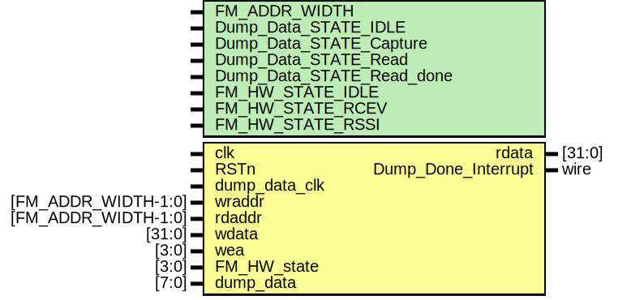

# Entity: FM_Dump_Data 

- **File**: FM_Dump_Data.v
## Diagram

## Generics

| Generic name              | Type | Value   | Description |
| ------------------------- | ---- | ------- | ----------- |
| FM_ADDR_WIDTH             |      | 13      |             |
| Dump_Data_STATE_IDLE      |      | 4'b0000 |             |
| Dump_Data_STATE_Capture   |      | 4'b0001 |             |
| Dump_Data_STATE_Read      |      | 4'b0010 |             |
| Dump_Data_STATE_Read_done |      | 4'b0100 |             |
| FM_HW_STATE_IDLE          |      | 4'b0000 |             |
| FM_HW_STATE_RCEV          |      | 4'b0010 |             |
| FM_HW_STATE_RSSI          |      | 4'b0100 |             |
## Ports

| Port name           | Direction | Type                | Description |
| ------------------- | --------- | ------------------- | ----------- |
| clk                 | input     |                     |             |
| RSTn                | input     |                     |             |
| dump_data_clk       | input     |                     |             |
| wraddr              | input     | [FM_ADDR_WIDTH-1:0] |             |
| rdaddr              | input     | [FM_ADDR_WIDTH-1:0] |             |
| wdata               | input     | [31:0]              |             |
| wea                 | input     | [3:0]               |             |
| FM_HW_state         | input     | [3:0]               |             |
| dump_data           | input     | [7:0]               |             |
| rdata               | output    | [31:0]              |             |
| Dump_Done_Interrupt | output    | wire                |             |
## Signals

| Name            | Type                    | Description |
| --------------- | ----------------------- | ----------- |
| mem_IQ          | reg [7:0]               |             |
| Data_dump_state | reg [3:0]               |             |
| dump_done_en    | reg                     |             |
| dump_temp       | reg                     |             |
| Dump_done       | reg                     |             |
| dump_data_addr  | reg [FM_ADDR_WIDTH-1:0] |             |
