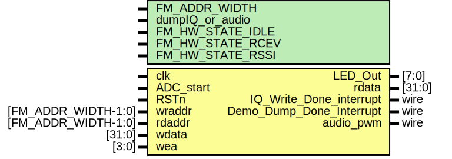

# Entity: FM_HW 

- **File**: FM_HW.v
## Diagram

## Generics

| Generic name     | Type | Value   | Description |
| ---------------- | ---- | ------- | ----------- |
| FM_ADDR_WIDTH    |      | 13      |             |
| dumpIQ_or_audio  |      | 1'b1    |             |
| FM_HW_STATE_IDLE |      | 4'b0000 |             |
| FM_HW_STATE_RCEV |      | 4'b0010 |             |
| FM_HW_STATE_RSSI |      | 4'b0100 |             |
## Ports

| Port name                | Direction | Type                | Description |
| ------------------------ | --------- | ------------------- | ----------- |
| clk                      | input     |                     |             |
| ADC_start                | input     |                     |             |
| RSTn                     | input     |                     |             |
| LED_Out                  | output    | [7:0]               |             |
| wraddr                   | input     | [FM_ADDR_WIDTH-1:0] |             |
| rdaddr                   | input     | [FM_ADDR_WIDTH-1:0] |             |
| wdata                    | input     | [31:0]              |             |
| wea                      | input     | [3:0]               |             |
| rdata                    | output    | [31:0]              |             |
| IQ_Write_Done_interrupt  | output    | wire                |             |
| Demo_Dump_Done_Interrupt | output    | wire                |             |
| audio_pwm                | output    | wire                |             |
## Signals

| Name                          | Type        | Description |
| ----------------------------- | ----------- | ----------- |
| adc_Power_down                | reg         |             |
| EOC                           | wire        |             |
| FM_HW_state                   | reg [3:0]   |             |
| RSSI_Scan_parameters          | reg [7:0]   |             |
| ADC_dump_parameters           | reg [4:0]   |             |
| FM_Receiver_parameters        | reg [4:0]   |             |
| CW_CLK                        | wire        |             |
| ADC_CLK                       | wire        |             |
| CLK_Lock                      | wire        |             |
| clk_PWM1                      | wire        |             |
| clk_PWM2                      | wire        |             |
| Channel                       | reg[2:0]    |             |
| ADC_Data                      | wire [11:0] |             |
| demodulated_signal_downsample | wire [9:0]  |             |
## Instantiations

- U1: PLL_Demodulation
- U2: ADC_Sampling
- FM_Dump_Data_IQ: FM_Dump_Data
- FM_Demodulation: FM_Demodulation
- Audio_PWM: Audio_PWM
