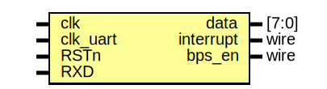

# Entity: UART_RX 

- **File**: UART_RX.v
## Diagram

## Ports

| Port name | Direction | Type  | Description |
| --------- | --------- | ----- | ----------- |
| clk       | input     |       |             |
| clk_uart  | input     |       |             |
| RSTn      | input     |       |             |
| RXD       | input     |       |             |
| data      | output    | [7:0] |             |
| interrupt | output    | wire  |             |
| bps_en    | output    | wire  |             |
## Signals

| Name       | Type      | Description |
| ---------- | --------- | ----------- |
| shift_reg  | reg [7:0] |             |
| re_start   | wire      |             |
| counter_en | reg       |             |
| counter    | reg [3:0] |             |
