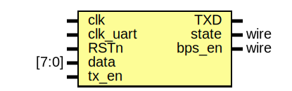

# Entity: UART_TX 

- **File**: UART_TX.v
## Diagram

## Ports

| Port name | Direction | Type  | Description |
| --------- | --------- | ----- | ----------- |
| clk       | input     |       |             |
| clk_uart  | input     |       |             |
| RSTn      | input     |       |             |
| data      | input     | [7:0] |             |
| tx_en     | input     |       |             |
| TXD       | output    |       |             |
| state     | output    | wire  |             |
| bps_en    | output    | wire  |             |
## Signals

| Name         | Type       | Description |
| ------------ | ---------- | ----------- |
| FIFOrd_en    | wire       |             |
| FIFOwr_en    | wire       |             |
| FIFOdata     | wire [7:0] |             |
| FIFOempty    | wire       |             |
| FIFOfull     | wire       |             |
| counter_en   | reg        |             |
| counter      | reg [3:0]  |             |
| trans_finish | wire       |             |
| trans_start  | wire       |             |
| data_formed  | wire [9:0] |             |
## Instantiations

- FIFO: FIFO
