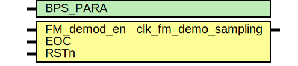

# Entity: clk_fm_demo_sample_pwm 

- **File**: clk_fm_demodulation.v
## Diagram

## Generics

| Generic name | Type | Value | Description |
| ------------ | ---- | ----- | ----------- |
| BPS_PARA     |      | 10    |             |
## Ports

| Port name            | Direction | Type | Description |
| -------------------- | --------- | ---- | ----------- |
| FM_demod_en          | input     |      |             |
| EOC                  | input     |      |             |
| RSTn                 | input     |      |             |
| clk_fm_demo_sampling | output    |      |             |
## Signals

| Name | Type      | Description |
| ---- | --------- | ----------- |
| cnt  | reg	[5:0] |             |
