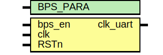

# Entity: clkuart_pwm 

- **File**: clkuart_pwm.v
## Diagram

## Generics

| Generic name | Type | Value | Description |
| ------------ | ---- | ----- | ----------- |
| BPS_PARA     |      | 434   |             |
## Ports

| Port name | Direction | Type | Description |
| --------- | --------- | ---- | ----------- |
| bps_en    | input     |      |             |
| clk       | input     |      |             |
| RSTn      | input     |      |             |
| clk_uart  | output    |      |             |
## Signals

| Name | Type       | Description |
| ---- | ---------- | ----------- |
| cnt  | reg	[12:0] |             |
